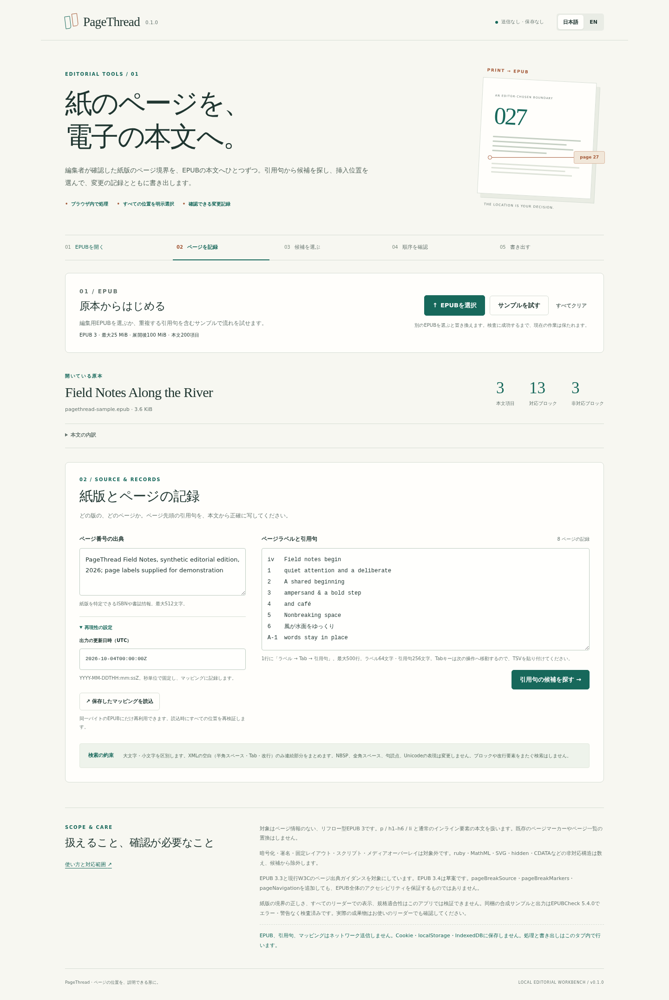

# PageThread

**紙のページを、電子の本文へ。** An editorial page-boundary mapper for an existing EPUB.

An editor supplies a named edition and “page 42 begins before these words.” PageThread finds the possible locations, asks the editor to choose each one, checks their spine order, and exports the EPUB with page markers, a page list, source metadata and a hash-bound review packet.

EPUB と引用句をブラウザ内で処理します。同じ句が複数回ある場合は、章と前後の本文を見て位置を選びます。紙版のページ位置を推測せず、編集者が指定した位置を説明できる形で書き出します。

## Try the original demo

1. Load the sample EPUB
2. Search its eight supplied boundary phrases
3. Review the four occurrences of “A shared beginning”; the sample intentionally selects the third
4. Use the explicit sample selections, inspect the ordered preview, and export
5. Keep the EPUB, mapping JSON, receipt JSON and readable HTML report together

The original synthetic *Field Notes Along the River* has three spine documents with shuffled filenames, Roman and Arabic page labels, ordinary inline emphasis, escaped ampersands, emoji, combining marks, Japanese text, NBSP and ideographic spaces. It also has preserved ruby, hidden text and CDATA blocks outside the insertion profile. It contains no customer material.

[Original EPUB](tests/fixtures/field-notes.epub) · [Editorial records](tests/fixtures/records.json) · [Independent intended locations](tests/fixtures/expected-selection.json) · [Walkthrough](docs/DEMO.md)

## What the export changes

- Inserts one empty XHTML span immediately before each confirmed phrase, with an ID, `epub:type="pagebreak"`, `role="doc-pagebreak"` and the exact page label
- Appends one hidden, flat page-list navigation structure to the existing navigation document
- Appends `pageBreakSource`, `pageBreakMarkers` and `pageNavigation` metadata, and updates the one existing modified timestamp to the explicit mapping value
- Preserves original prose, markup, TOC, other metadata and all unrelated package entries

The mapping binds decisions to the exact input SHA-256. Each location records its source part, original element/text-node position and Unicode code-point offset. The receipt binds input, output, mapping, changed parts and every unchanged resource. Export is deterministic for one input and mapping.

There is no server, account, network upload, persistent browser storage, reader rendering or external-link visiting. Runtime code has no dependencies. Blob workers can be cancelled; imports keep the last valid book until replacement succeeds. Reloading clears the book.

## Matching rules and limits

Quotes are **case-sensitive**. Only XML whitespace (space, tab, CR and LF) collapses to one ordinary space, with matching phrase/block edge spaces removed. NBSP, ideographic space, punctuation and Unicode normalization remain exact. Page labels remain editor-provided; labels need not be numeric or unique.

Matches can span ordinary inline emphasis within one supported `p`, `h1`–`h6` or `li` block. They cannot cross block or `br` boundaries. Explicit hidden/inert/aria-hidden content, CDATA, ruby, MathML, SVG and other unsupported structures make a block ineligible. Source text is searched; CSS layout, visibility and text transformations are not calculated. The UI shows unsupported-block counts.

The v1 profile accepts one EPUB 3 package, reflowable XHTML spine content and an existing navigation document. Existing pagebreaks, page lists or pagination metadata are rejected to avoid replacement. Encrypted, signed, fixed-layout, scripted and media-overlay publications are excluded. The original content is never put into the browser DOM.

| Bound | Limit |
|---|---:|
| Input / output archive | 25 MiB each |
| Expanded archive | 100 MiB total, 30 MiB per entry |
| Archive entries / spine documents | 2,500 / 200 |
| Boundaries / quote / label / source | 500 / 256 / 64 / 512 code points |
| Inspected XML | 4 MiB per part, 16 MiB total |
| XML elements | 100,000 per part, 200,000 total |
| Searchable text / blocks | 2 MiB UTF-16 units / 20,000 |
| Candidate limits | 200 per boundary, 5,000 total |
| Search work | 100 MiB of bounded scan accounting |
| Saved mapping | 1 MiB |

Additional XML depth, name, attribute, namespace and text-node caps are in [limits.mjs](src/limits.mjs). A work or candidate cap rejects the request explicitly; results are never silently truncated.

## Verification status

Passed locally and in the [six-job hosted run](https://github.com/Masanori-Spec/page-thread/actions/runs/37195622780) at commit `11411ee7836a7001735b9db9bfb9117baa2a47d6`:

- **64 Node tests**, including model/security cases, nine actual UI-handler regressions and 14 independent reviewer cases
- Independent Python ZIP/XML verifier: all eight hand-authored boundary identities, five changed XML parts, four byte-identical untouched members and exact exported mapping hash
- Original XML structure/text/comments/PIs recovered after removing only declared additions and restoring the timestamp
- **33 adversarial mutations rejected after refreshing hashes**, plus a harmless XML-reserialization positive
- Official **EPUBCheck 5.4.0** on both source and output: zero fatal/error/warning/usage messages
- Syntax, static build and runtime network/storage primitive guards
- **14 sandbox-enabled Chromium scenarios**: explicit choices, keyboard skip/radio operation, actual downloads, repeat/replay, invalid imports, stale-worker cancellation/reset, offline-after-load export and cleared reload state
- JA desktop and 390px mobile views, EN preview, 320/768/1440px layouts and all four printed report pages inspected; no horizontal overflow or unfocused skip-link overlay
- Actual browser EPUB, mapping, receipt and HTML match module replay and the independent Python oracle; repeated, restored and offline EPUB exports are byte-identical

[Verification record](docs/VERIFICATION.md) · [Independent oracle](docs/ORACLE.md) · [Pinned hosted evidence](docs/hosted-evidence/evidence.json) · [Hosted validator reports](docs/hosted-evidence/epubcheck/results.json)



[Japanese mobile view](docs/hosted-evidence/browser/mobile-ja.png) · [English confirmed preview](docs/hosted-evidence/browser/desktop-en-preview.png) · [Four-page review PDF](docs/hosted-evidence/browser/review.pdf) · [Actual exported EPUB](docs/hosted-evidence/browser/paginated.epub)

Evidence is pinned to the commit and run above. A later documentation commit needs its own external CI audit; `npm run package` rechecks retained hashes and replays exports, and does not rerun hosted jobs. Local browser restrictions were not bypassed. Reading systems, other browser engines, real mobile hardware, assistive technology, physical printers and overall accessibility remain unverified. The [original independent functional review](docs/INDEPENDENT_REVIEW.md) stays unchanged; the [dated hosted review addendum](docs/HOSTED_REVIEW_ADDENDUM.md) records the later checks and repairs.

64件の自動テスト、独立したXML保存検証、14件のブラウザ操作、実際のダウンロードと4ページの印刷PDFを確認済みです。確認結果は上記コミットに結び付けています。実際のEPUBリーダー、実機のスマートフォン、支援技術、編集者が指定した紙版の境界の正しさは未検証です。

The implementation profile uses EPUB 3.3 structure plus current W3C pagination-source guidance. EPUBCheck 5.4.0 reports its current EPUB 3.4 Candidate Recommendation profile; this is **not a final EPUB 3.4 conformance claim**. Neither the validator nor the preservation oracle can establish that the editor supplied the correct print-edition boundaries. No universal reader, overall accessibility, demand or novelty claim is made.

## Run and verify

Node 22+ and Python 3.12+ are used by hosted CI. The production app is static; Playwright is a development-only dependency.

```sh
npm ci --ignore-scripts
npm run build
npm run serve
npm run check
```

Open `http://127.0.0.1:4179` in an environment where browser access is permitted. Files in `dist/` form the complete static app.

For the official validator, download the [official EPUBCheck 5.4.0 release](https://github.com/w3c/epubcheck/releases/tag/v5.4.0), verify its archive SHA-256 below, extract it, and use Java 21:

```sh
node scripts/fixture-output.mjs
EPUBCHECK_JAR=/absolute/path/epubcheck.jar npm run test:epubcheck
```

Pinned official release archive SHA-256: `33350c61038e71dfb3d45a76aed04bf5481e6d5500cb780f6e98db8bbd15a28c`. The validator binary is not included in this source repository. Its own licensing remains with its authors; no project license has been selected.

```sh
npm run test:browser  # requires the running local server and sandboxed Chromium
npm run test:evidence # checks retained run hashes and replays its actual exports
npm run package      # runs local checks and freezes source/manifest; does not run hosted CI
```

## Why this workflow

Existing tools already generate page lists or approximate pagination. PageThread focuses on explicit phrase alignment for an existing EPUB when the original layout project is unavailable: repeated-candidate decisions, exact source identities and preservation evidence. That is a workflow hypothesis, not proven demand. [Research and competitors](docs/RESEARCH.md) · [Interview narrative and questions](docs/INTERVIEW.md)
